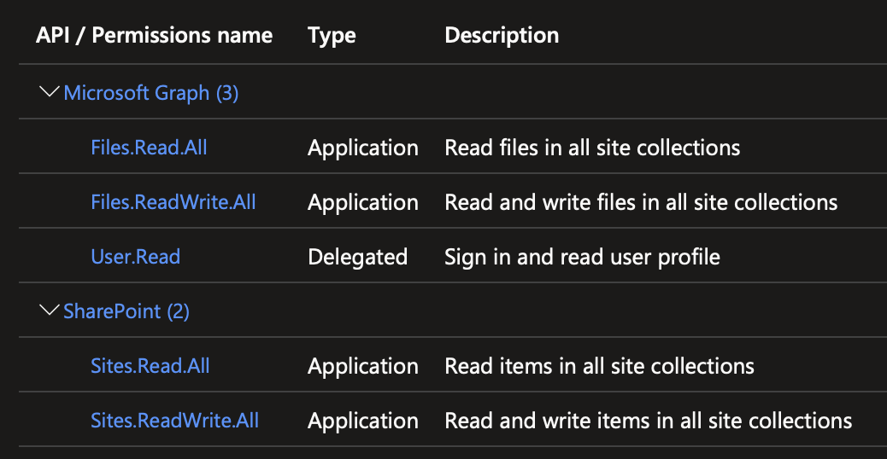

# SharePoint Online Git Repo Archive

This is a GitHub Action designed to copy an archive (`.zip`) of the given GitHub repository to SharePoint Online when a push happens. The action will keep the 4 most recent archives available, deleting the oldest archives if the number in the given directory becomes greater than 4.

## App Registration

As described below, this action requires an application be registered in Azure AD with the appropriate permissions. Covering that process in detail is beyond the scope of this document, but it is [documented by Microsoft](https://learn.microsoft.com/en-us/azure/active-directory/develop/quickstart-register-app).

The app will need to have the following API permissions:

### Microsoft Graph

- `Files.Read.All`
- `Files.ReadWrite.All`
- `User.Read`

### SharePoint

- `Sites.Read.All`
- `Sites.ReadWrite.All`

## Inputs

The following inputs are required. It's recommended to use GitHub Actions Secrets to store them safely, especially the secret:

- `spobkp_authority`: O365 tenant authority, e.g.: `https://login.microsoftonline.com/{company}.onmicrosoft.com`
- `spobkp_endpoint`: SharePoint endpoint to target for file upload, e.g.: `https://graph.microsoft.com/v1.0/drives/{site_collection_id}/root:/{directory name}:/children/`
- `spobkp_scope`: Graph API scope, defaults to: `https://graph.microsoft.com/.default`
- `spobkp_clientid`: Client ID for the application registered in Azure AD.
- `spobkp_secret`: Secret for the application registered in Azure AD.
- `debug`: Whether or not to enable debug logging. Defaults to `false`.

